1. установлен minikube, дополнительный, чтобы не удалять более новый, который мне нужен на хосте

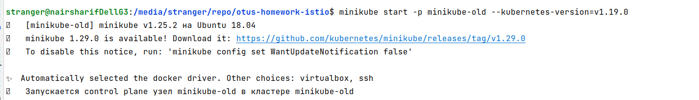

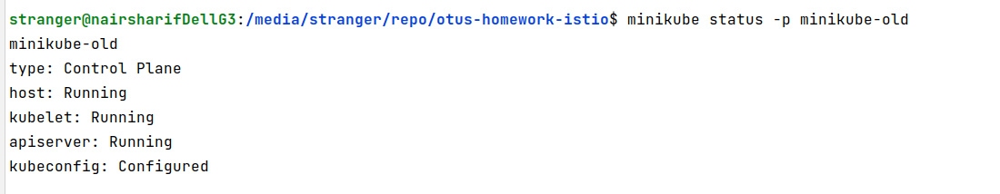

2. создаем неймспейсы для операторов

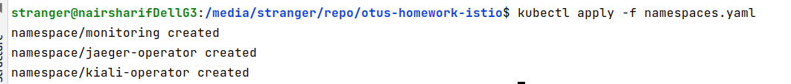

3. устанавливаем istioctl

и добавляем в .bashrc строку

`
export PATH=$HOME/.istioctl/bin:$PATH
`

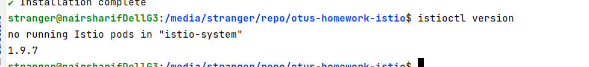

4. helm у меня уже был установлен, пользовался ранее

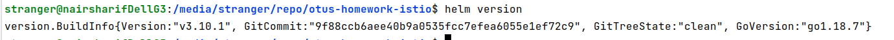

5. разворачиваем jaeger

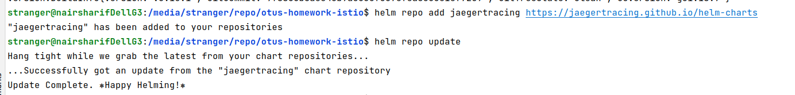

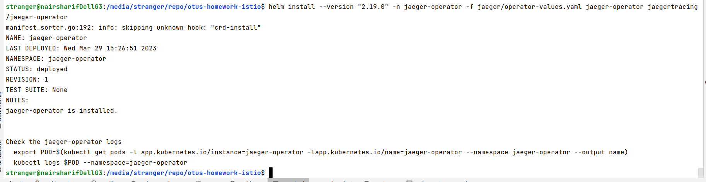

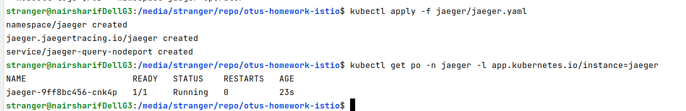

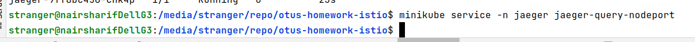

6. Разворачиваем Prometheus

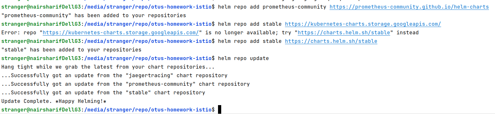

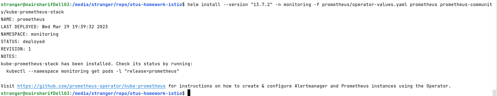

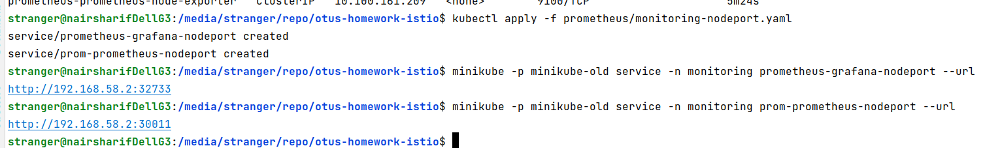

7. Разворачиваем Istio

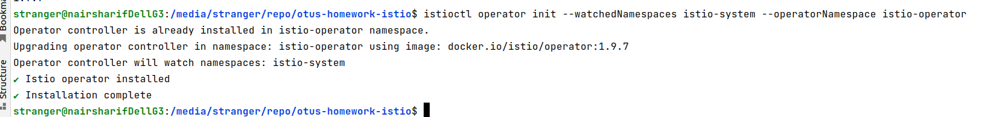

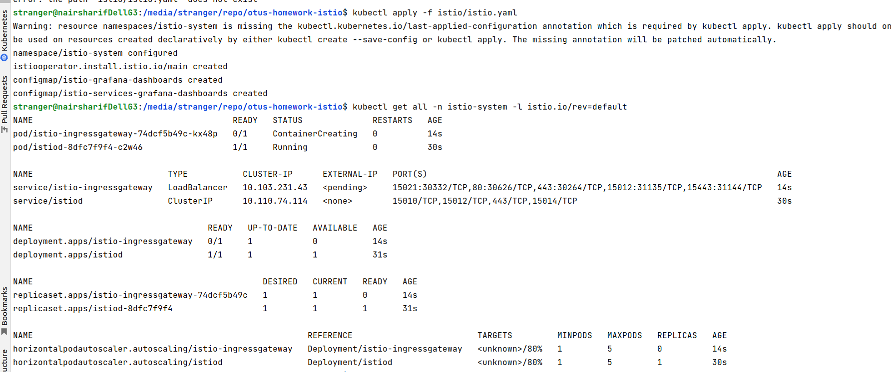

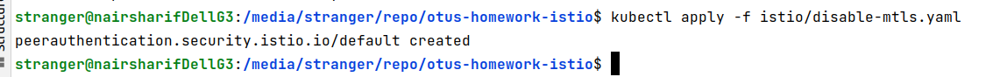

8. Устанавливаем Kiali

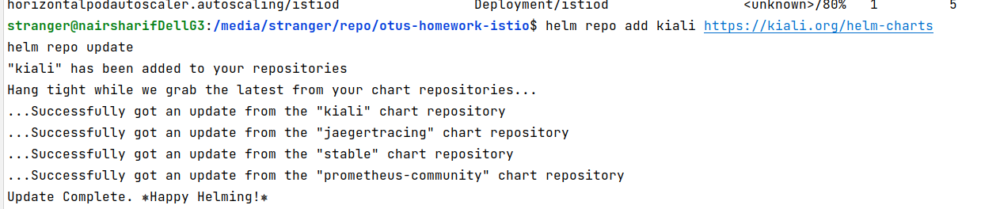

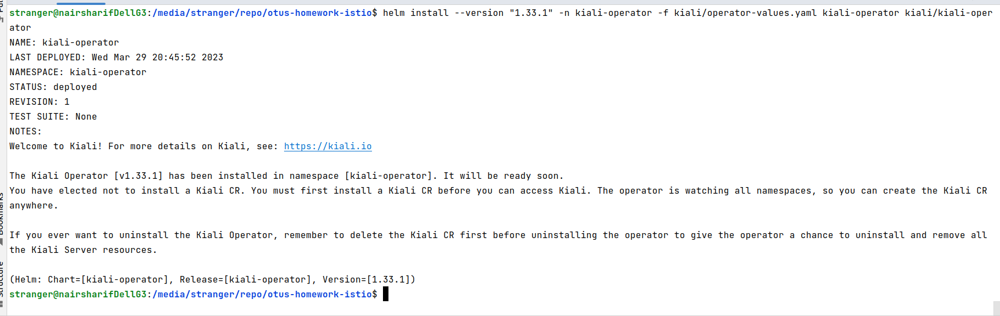

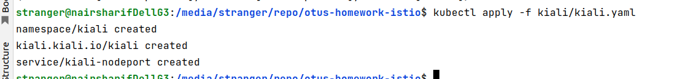

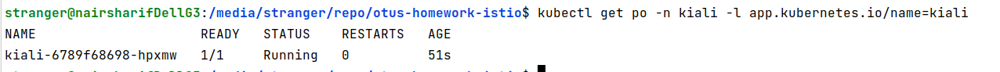

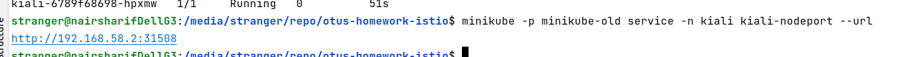

9. Собираем две версии приложения

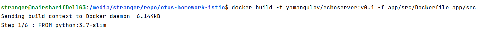

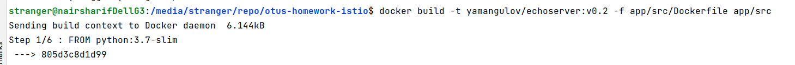

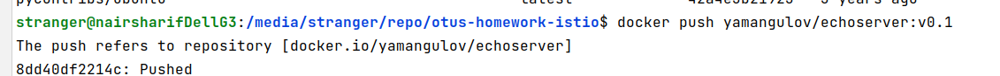

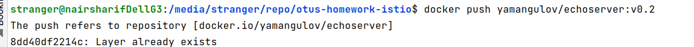

10. Готовим и запускаем балансировку двух версий приложения

[манифесты для запуска объектов kubernetes](manifests)

11. Проверка результатов

находим шлюз istio

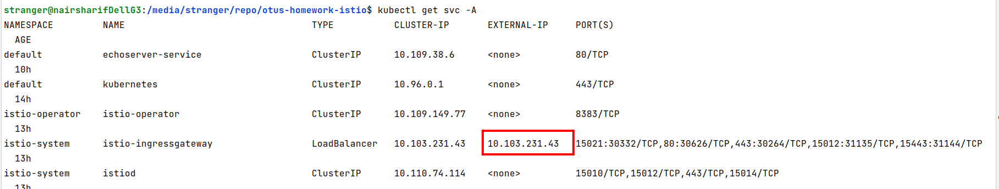

так как никакого ingress внутрь minikube я не настраивал, можно проверить трафик istio просто изнутри кластера кубера, для этого зайдем в кластер командой

`minikube -p minikube-old ssh`

и что-нибудь пошлем в шлюз, можно пинг, можно curl

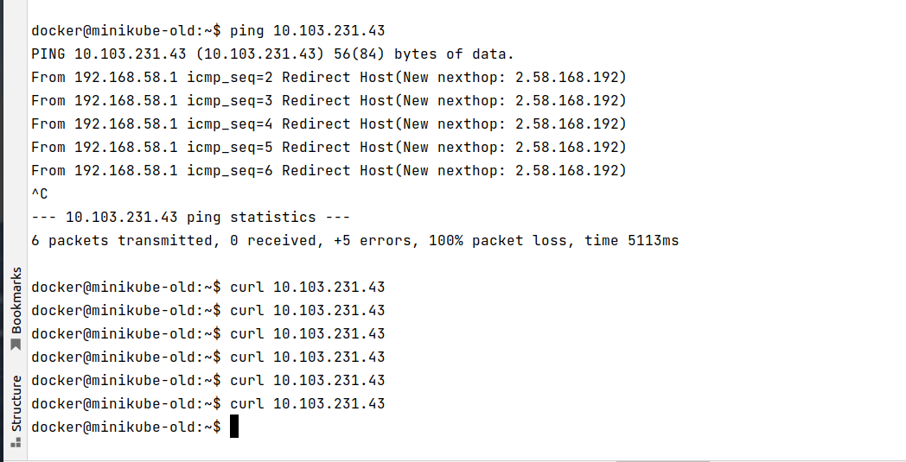

в результате получим [диаграмму](/home/stranger/Изображения/kiali-diagram-result.jpg) в Kilio, отображающую трафик и схему istio

