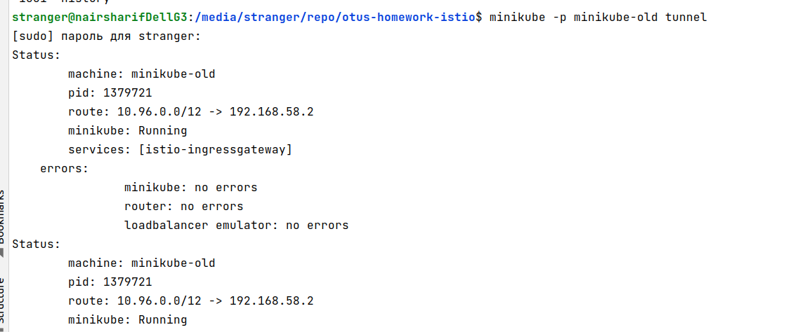

1. установлен minikube, дополнительный, чтобы не удалять более новый, который мне нужен на хосте

2. создаем неймспейсы для операторов

3. устанавливаем istioctl

и добавляем в .bashrc строку

`
export PATH=$HOME/.istioctl/bin:$PATH
`

4. helm у меня уже был установлен, пользовался ранее

5. разворачиваем jaeger

6. Разворачиваем Prometheus

7. Разворачиваем Istio

8. Устанавливаем Kiali

9. Собираем две версии приложения

10. Готовим и запускаем балансировку двух версий приложения

[манифесты для запуска объектов kubernetes](manifests)

11. Проверка результатов

находим шлюз istio

необходимо также открыть для minikube туннель, иначе не будет доступа снаружи кластера и istio-ingressgateway будет все время в статусе pending

`minikube -p minikube-old tunnel` и через некоторое время ввести пароль root

затем дважды проверим работу istio - один раз прямо внутри кластера, зайдя в него по ssh командой minikube -p minikube-old ssh и затем curl на external ip

затем проверяем доступ извне кластера по тому же ip

а также проверим работу через браузер

в результате получим [диаграмму](kiali-diagram-result.jpg) в Kilio, отображающую трафик и схему istio

мы видим на ней два источника - unknown это для случая, когда я курлил сервис изнутри кластера, а именованный источник - для случаев, когда я курлил сервис через istio-ingressgateway

